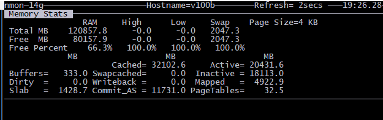

## Homework 09 Distributed High Performance Computation with GPUs

## QUESTIONS
**1. How long does it take to complete the training run? (hint: this session is on distributed training, so it will take a while)**  
It took 24 hours with 2 V100 GPU

**2. Do you think your model is fully trained? How can you tell?**  
 

As we can see that the eval_loss is flattened, but BLUE score is still moving. so we are approaching to the end of training. 

**3. Were you overfitting?**  
Based on the graph of train_loss and eval_loss (picture above), the train loss is comparable to the evaluation loss. It basically shows that there is a high possibility of not overfitting.

**4. Were your GPUs fully utilized?**   
Yes. can you see from below screenshots that GPUs are fully utilized to 90-100%

**5. Did you monitor network traffic (hint: apt install nmon ) ? Was network the bottleneck?**  
Based on below screenshots, it does not look like there is any betwork bootleneck.

**6. Take a look at the plot of the learning rate and then check the config file. Can you explan this setting?**  
   The config file had the initial learning rate of 2.0 with "warmup_steps" of 8,000. If you observe the learning_rate graph, we can see the learning rate climb until the 8,000th step and start to decline afterwards.
   

**7. How big was your training set (mb)? How many training lines did it contain?**  

**8. What are the files that a TF checkpoint is comprised of?**  

**9. How big is your resulting model checkpoint (mb)?**  

**10. Remember the definition of a "step". How long did an average step take?** 
1.694s

**11. How does that correlate with the observed network utilization between nodes?** 
The correlation between network speed and step duration is negative. Teh higher the network, the faster the step, hence the smaller the step duration for each step. 
